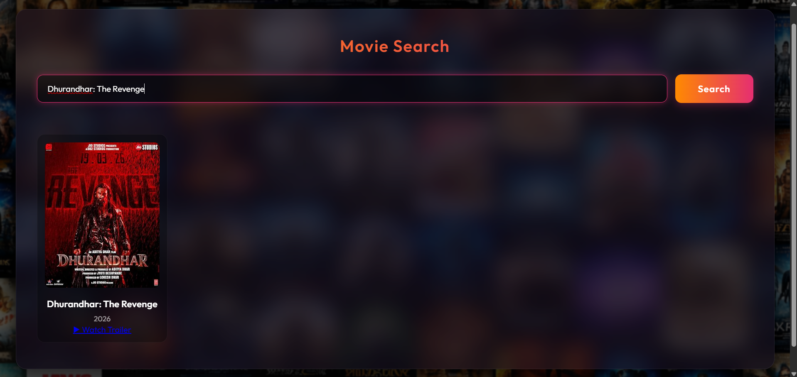

# Movie App

A simple movie search web application built using HTML, CSS, and JavaScript.

## Features
- User login with local JSON validation
- Search movies using OMDb API
- Display movie posters, titles, and year
- Redirect to YouTube for trailer search
- Responsive UI

## Tech Stack
- HTML
- CSS
- JavaScript (Vanilla)
- OMDb API

## How to Run
### Option 1 (Recommended)
- Open project in VS Code
- Install Live Server extension
- Right click index.html → Open with Live Server

### Option 2
- Run:
  python -m http.server
- Open:
  http://localhost:8000

## Project Structure
- index.html
- style.css
- app.js
- users.json

## Notes
- Replace OMDb API key in app.js

## Screenshots

